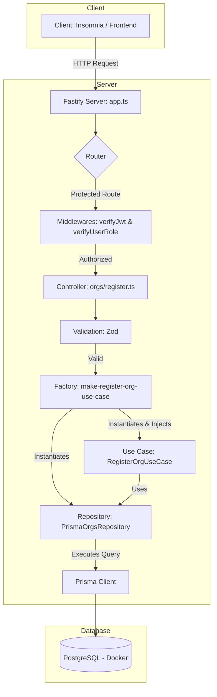

[](https://github.com/andredevic/API_solid_FindAPet/actions/workflows/run-e2e-tests.yml)
[](https://github.com/andredevic/API_solid_FindAPet/actions/workflows/run-unit-tests.yml)

[](LICENSE)


# 🐾 Find a Pet API

A RESTful API developed in **Node.js** with **Fastify** for a pet adoption system, allowing organizations (ORGs) to register pets and users to find and adopt them.

This project was built with a focus on best development practices, utilizing **SOLID principles**, a **layered architecture** (use cases, controllers, repositories), **automated testing** (unit and e2e), and a **robust authentication and authorization system**.

---

## ✨ Key Features

- **Secure Authentication with JWT**  
  Implements short-lived access tokens and Refresh Tokens (stored in httpOnly cookies) for a secure and continuous session.

- **Role-Based Access Control (RBAC):**
  - **ADMIN**: Users with permission to manage critical entities, such as registering new organizations.  
  - **MEMBER**: Standard users with permission to search for and adopt pets.  

- **Org & Pet Management**  
  Organizations can manage their own pets, and administrators control the registration of new organizations.

- **Geospatial Search**  
  An endpoint to find nearby ORGs based on the user's latitude and longitude coordinates.

- **Dockerized Development Environment**  
  The PostgreSQL database is managed with Docker, ensuring a consistent and isolated development environment.

- **Data Validation with Zod**  
  Ensures that all data entering the application is valid and secure.

---

## 🛠️ Tech Stack

- Node.js  
- Fastify (Web Framework)  
- Prisma (ORM)  
- PostgreSQL (Database)  
- Docker  
- Vitest (Unit & E2E Testing)  
- Zod (Schema Validation)  
- TypeScript  

---

## 🏛️ Application Architecture

The application follows the principles of **clean architecture** and **SOLID**, separating responsibilities into distinct layers.  



**Flow Explanation (Example: POST /orgs)**

- A request arrives at the Fastify Server.

- The Router directs it to the corresponding controller, but first triggers the Middlewares.

- verifyJwt and verifyUserRole ensure the user is authenticated and has the ADMIN role.

- The Controller validates the body with Zod and calls the Factory.

- The Factory instantiates the Repository and injects it into the Use Case.

- The Use Case executes business logic and persists data via Prisma.

- Prisma communicates with PostgreSQL, and the response is returned to the client.

  ---

## 🚀 Getting Started

Follow the steps below to set up and run the application locally.

### Prerequisites
- **Node.js** (v18 or higher)
- **Docker** and **Docker Compose**

### 1. Clone the Repository
```sh
git clone <your-repository-url>
cd <repository-name>
```
### 2. Install Dependencies
```sh
npm install
```
### 3. Set Up Environment Variables
Create a .env file in the project root by copying the example file.

```sh

cp .env.example .env
Edit the .env file if necessary. The default settings are suitable for the Docker environment.
```

### 4. Start the Database with Docker
With Docker running, start the PostgreSQL database container:
```sh

docker-compose up -d
```
### 5. Run Prisma Migrations
This command will create the tables in your database according to the schema.

```sh

npx prisma migrate dev
```
### 6. Start the Application
```sh

npm run dev
Your API will now be running at http://localhost:3333.
```
---

## 🧪 Running the Tests
The application has a complete test suite.

### Run unit tests
```sh

npm run test
```
### Run end-to-end (e2e) tests
(Requires the test database to be running in Docker)

```sh

npm run test:e2e
```
---

## 📖 API Endpoints
Below is an overview of the main API flows and endpoints.

## Authentication (Users & ORGs)

| Method | Route                 | Description                                      |
| ------ | --------------------- | ------------------------------------------------ |
| POST   | `/users`              | Registers a new user (MEMBER).                   |
| POST   | `/sessions`           | Authenticates a user and returns a JWT.          |
| PATCH  | `/token/refresh`      | Refreshes the access token using a refreshToken. |
| POST   | `/orgs/sessions`      | Authenticates an ORG and returns a JWT.          |
| PATCH  | `/orgs/token/refresh` | Refreshes the ORG's access token.                |


## Administrator (ADMIN) Flow

| Method | Route   | Protected?  | Description                   |
| ------ | ------- | ----------- | ----------------------------- |
| POST   | `/orgs` | Yes (Admin) | Registers a new organization. |

## User Flow (MEMBER role required)

| Method | Route                     | Protected?   | Description                           |
| ------ | ------------------------- | ------------ | ------------------------------------- |
| GET    | `/pets/search`            | No           | Searches for pets (city is required). |
| GET    | `/pets/:petId`            | No           | Gets the details of a specific pet.   |
| POST   | `/pets/:petId/adopt`      | Yes (Member) | Adopts a pet.                         |
| GET    | `/user/adoptions/history` | Yes (Member) | Views the user's adoption history.    |


## Organization Flow (ORG authentication required)

| Method | Route                     | Protected? | Description                                    |
| ------ | ------------------------- | ---------- | ---------------------------------------------- |
| POST   | `/pets`                   | Yes (ORG)  | Registers a new pet for the authenticated ORG. |
| GET    | `/orgs/adoptions/history` | Yes (ORG)  | Views the ORG's adoption history.              |

--- 

## ✒️ Author
André Ferreira

